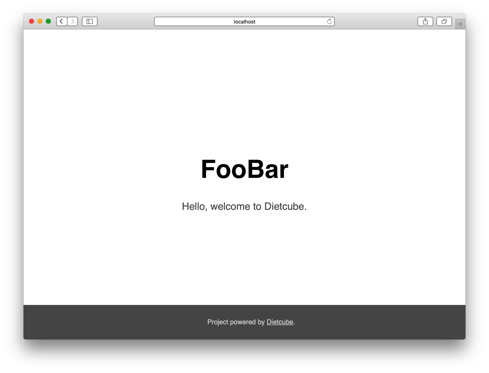

# Create Project and Configuration

It is very easy to create Dietcube application with `composer` command.


## Create Project

To create project with project skeleton, run following command:


    composer create-project dietcube/dietcube-project -s dev your-project


`your-project` is just a name of directory to craete. If you already decided your project name, please use that name instead.

This directory name is used for the application namespace.
If you create project with `your-project`, Dietcube's initialize script replace the namespace of project skeleton from `SampleApp` to `YourProject`. This is camelized name of the directory. (So if you want to create your project with `FooBar` namespace for excample, you have to use `foo-bar` as a direcotry name instead).

After created the project, you can try to run the application with PHP built-in server:


    $ cd foo-bar

    $ DIET_ENV=development php -d variables_order=EGPCS -S 0:8999 -t webroot/

Then you can access the application with your browser using `8999` port to the host.




## Directory Structure

Let's take a look at the direcotry structure.

    app
    |-- Application.php
    |-- Controller
    |   `-- TopController.php
    |-- Route.php
    |-- Service
    |   `-- SampleService.php
    |-- config
    |   |-- config.php
    |   |-- config_development.php
    |   `-- config_development.php.sample
    `-- template
        `-- index.html.twig
    tests
    |-- Service
    |   `-- SampleServiceTest.php
    `-- bootstrap.php
    webroot
    `-- index.php

### `app` directory

`app` directory is the application main directory. It contains Application class, Route class, config directory, Controller directory, Service directory and template directory.

- `Application`
    - Application class is the application context class. Application class configures DI container, and so far.
    - See [Reference/Application](../references/application.md) for more information.
- `Route`
    - Route class defines the routing information.
    - See [Reference/Route And Router](../references/route-and-router.md) for more information.
- `config`
    - config directory contains the configuration file. Configuration is explained below.
    - See [Reference/Configuration](../references/configuration.md) for more information.
- `Controller`
    - Controller directory has controllers of the application.
    - See [Reference/Controller](../references/controller.md) for more information.
- `Service`
    - Service directory is the sample directory structure. To use Dietcube, Service directory is not must be there. You can create any directory under `app` directory if you need.
    - The good way of designing and developing, see [Reference/Designing and Services](../references/designing-and-services.md).
- `template`
    - Teamplte directory has template files of Twig by default.
    - See [Reference/Templating](../references/template.md) for more information.

### `tests` directory

`tests` directory contains tests for the applicaiton.

By default, sample test file for `SampleService` is in `tests`.

You can run tests with `phpunit` command:

	$ phpunit
	PHPUnit 5.1.4 by Sebastian Bergmann and contributors.

	.

	Time: 86 ms, Memory: 3.50Mb

	OK (1 test, 1 assertion)


### `webroot` directory

`webroot` directory is a directory of the document root of the web server.

Here are examples for several web servers.

If you use apache:

```
<VirtualHost *:80>
    ServerName foo-bar.example.com
    DocumentRoot /path/to/foo-bar/webroot
    DirectoryIndex index.php

    SetEnv DIET_ENV production

    <IfModule mod_rewrite.c>
       RewriteEngine On
       RewriteBase /

       RewriteCond %{REQUEST_FILENAME} -f
       RewriteRule index.php - [QSA,L,C]
       RewriteRule .* - [QSA,L]

       RewriteCond %{REQUEST_FILENAME} !-f
       RewriteRule ^(.*)$ index.php [QSA,L]
    </IfModule>
</VirtualHost>
```

If you use nginx:

```
server {
    server_name foo-bar.example.com;
    root /path/to/foo-bar/webroot;
    set $app_root "index.php";
    index $app_root;

    // this is for front-controller
    try_files $uri $uri/ /$app_root?$query_string;

    location ~ \.php$ {
        // several fastcgi directives ...
        fastcgi_param DIET_ENV production;
    }
}
```

CAUTION: Do not use PHP built-in server in production.

## Configuration

Project skeleton has `config.php` and `config_development.php` in `app/config` directory.

Both of files just returns an array

- `config.php`
    - `config.php` is always loaded by Application. This config file should include env-independent configuratoin or default configuration.
- `config_development.php`
    - `config_development.php` should have env specific configuration. Like `debug` flag, log setting and so far.
    - `development` is just a example of environment name.
    - Actually, load file is decieded by `DIET_ENV`, and `config_{DIET_ENV}.php` will be loaded.
    - Environment specific config will be merged to default config (defined by `config.php`).


In fact, the element of `config.php` with the same key will be replaced by environmental configuration.

For example:

`config.php`:

```php
<?php

use Monolog\Logger;

return [
    'debug' => false,

    'logger' => [
        'path' => dirname(dirname(__DIR__)) . '/tmp/app.log',
        'level' => Logger::WARNING,
    ],
];
```


`config_development.php`:

```php
<?php

use Monolog\Logger;

return [
    // debug and logger elemnt will be overwritten by this file.
    'debug' => true,

    'logger' => [
        'path' => dirname(dirname(__DIR__)) . '/tmp/app_development.log',
        'level' => Logger::DEBUG,
    ],
];
```


`config_production.php`:

```php
<?php

return [
    // debug and logger elemnt will not be overwritten by this file.

    // twig file will be cached on production env.
    'twig' => [
        'cache' => dirname(dirname(__DIR__)) . '/tmp/twig/',
    ],
];
```

